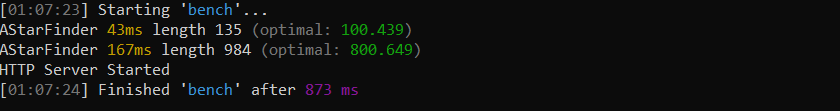
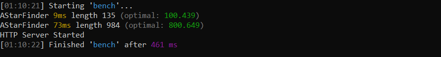
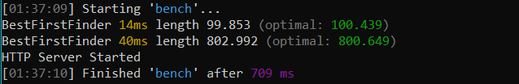
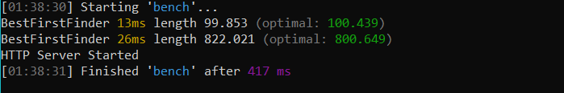

LETS EXPLORE THE MARS!!

Check out the Project! 

==============

Initiatives
------------

* Under the guidance of my senior, I have implemented a new heuristic in the project, named Optimized Manhattan. After testing the heuristic on benchmarks, we observed approximately a 50% reduction in execution time for the A algorithm and around a 15% reduction in time for Best First Search. The length of the path and the number of operations remain unchanged. To ensure optimal pathfinding, we have not applied a greedy algorithm that could compromise accuracy. *

The first picture shows the results for bench in case of standard manhatten for A star algorithm, when diagonal traversal is set to 'false'. The second shows the execution of new heuristic.

The first picture shows the results for bench in case of standard manhatten for Best First Search, when diagonal traversal is set to 'false'. The second shows the execution of new heuristic.

* Adding an option of speed in the naivigation bar, the speed with which the rover reaches the space station can be managed. *

Gateway Heuristic
------------

The maze and patterns present in the repository were added to test a new heuristic called the Gateway heuristic. The gateway heuristic pre-calculates the distances between entrances/exits of the areas. It also proceeds in two phases.
Preprocessing Phase:
The map is decomposed into areas in an identical way as for the dead-end heuristic. We define the boundaries between areas as gateways (or gates). A gateway can be of an arbitrary size, but an artifact of our decomposition algorithm is that its orientation is always either horizontal or vertical. Next we use multiple A* searches to pre-calculate the (static) distance between gates. For each gateway we calculate the path distance to all the other gateways (cost of infinity if no path exists). Alternatively, one could calculate only the distances between gateways within each room and then use a small search to accumulate the total cost during run-time. However, our approach results in more accurate heuristic estimates and faster run-time access
